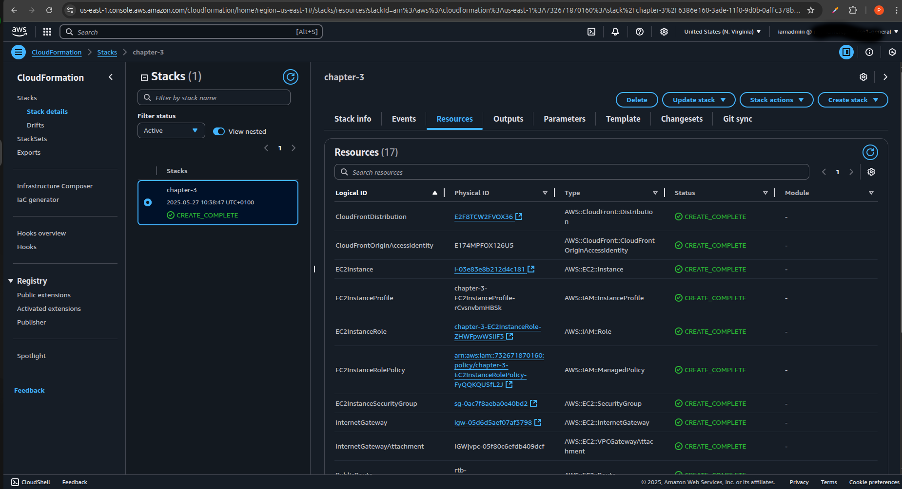
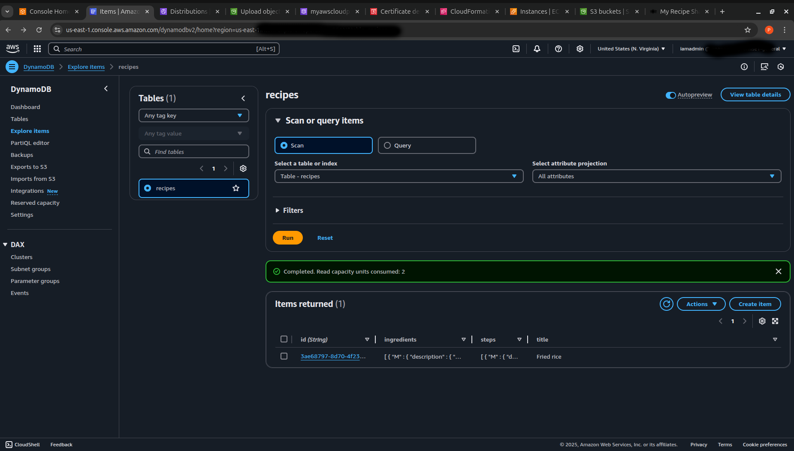

# Cloud-Native Recipe Sharing App


---

## 🧾 Project Description

This project is a full-stack **cloud-native web application** built with a modern architecture and deployed entirely on **AWS Cloud** services. It enables users to share, view, and manage recipes.

The frontend is built with **React.js** and hosted via **Amazon S3** with global distribution through **CloudFront**. The backend is developed using **Python FastAPI** running on an **EC2 instance in a private subnet**, with **Application Load Balancer** (ALB) handling traffic. **DynamoDB** is used to store recipe data. Infrastructure provisioning is handled using **AWS CloudFormation**.

---

## 🛠 Tech Stack

### Frontend
- React.js (Vite)
- AWS S3 (Static Hosting)
- AWS CloudFront (CDN & SSL)
- Route 53 (Domain DNS)
- AWS ACM (SSL certificate)

### Backend
- Python + FastAPI
- Amazon EC2 (in a private subnet)
- Application Load Balancer (ALB)
- IAM roles for secure access

### Database
- Amazon DynamoDB

### Infrastructure
- AWS CloudFormation
- YAML templates (`ch3-https.yaml`, `ch3-https-complete.yaml`)

---

## 📦 Features

- 🔐 HTTPS-secured frontend via CloudFront & ACM
- 🖼️ Server-rendered frontend from S3
- ⚡ FastAPI backend hosted in private subnet
- 📂 Recipes stored in a DynamoDB table
- 🧰 CloudFormation used for provisioning AWS infrastructure
- 🌐 Domain managed via Route 53

---

## 📷 Screenshots

### 🌐 Frontend UI


### ⚙️ AWS Architecture


### CloudFormation Stack


### AWS DynamoDB Table


---

## 🚀 Deployment Instructions

### 🛠 Prerequisites
- AWS Account with admin access
- Verified domain (e.g. via Namecheap)
- SSL Certificate via AWS ACM (in **us-east-1**)
- AWS CLI configured locally

### 🔧 Steps

1. Clone the repository:

   ```bash
   git clone https://github.com/PromiseUgochukwuNnanemere/Cloud-Native-Recipe-Sharing-App.git
   cd Cloud-Native-Recipe-Sharing-App/platform
 
2. Launch CloudFormation:
   Deploy using the complete template with HTTPS: 

   ```bash 
   aws cloudformation deploy \
   --template-file ch3-https-complete.yaml \
   --stack-name recipe-app-stack \
   --capabilities CAPABILITY_NAMED_IAM

3. Upload your frontend build to S3:
   
   ```bash
   cd ../frontend
   npm install
   npm run build
   aws s3 sync dist/ s3://your-s3-bucket-name

 4. Invalidate CloudFront cache:
    
    ```bash
    aws cloudfront create-invalidation \
    --distribution-id YOUR_DISTRIBUTION_ID \
    --paths "/*"

 5. Verify application via your custom domain (with HTTPS)

---
   
## 🧪 Local Development

**Backend (FastAPI)**

``` bash 
cd backend/
pip install -r requirements.txt
uvicorn main:app --reload
```

**Frontend (React)**
```bash
cd frontend/
npm install
npm run dev
```
---

## 🧱 Cloud Architecture Overview
   ✅ 1 VPC
   
   ✅ 2 public + 2 private subnets
   
   ✅ 1 NAT Gateway
   
   ✅ 1 EC2 instance (private subnet)
   
   ✅ 1 Application Load Balancer
   
   ✅ IAM roles for backend instance access
   
   ✅ S3 + CloudFront for static hosting
   
   ✅ DynamoDB for NoSQL storage
   
---

## 📂 Project Structure

```
Cloud-Native-Recipe-Sharing-App/
├── backend/
│   ├── main.py
│   └── requirements.txt
├── frontend/
│   ├── public/
│   ├── src/
│   ├── dist/
│   ├── index.html
│   └── package.json
├── platform/
│   ├── ch3-https.yaml
│   └── ch3-https-complete.yaml
└── README.md

```
---

## 📌 Future Enhancements

- Provision API using AWS Auto Scaling groups (ASGs)
- Use AWS Amplify for hosting, and to connect the code repository and configure a CI/CD pipeline
- Use Amazon Cognito to simplify the process of adding user authentication and authorisation to the web and mobile applications.
- Use CloudWatch Logs for logging and CloudWatch Metrics for monitoring
- Use DynamoDB Accelerator (DAX) to improve the read performance of DynamoDB by clustered in-memory caching of frequent queries and responses

---

## 👨‍💻 Author

**Promise Ugochukwu Nnanemere**  
AWS Certified Solutions Architect Associate  
[LinkedIn](https://linkedin.com/in/promiseugochukwunnanemere)

---

## 📜 License

This project is licensed under the MIT License - see the [LICENSE](LICENSE) file for details.
