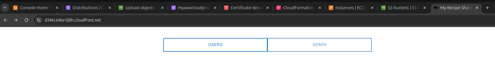
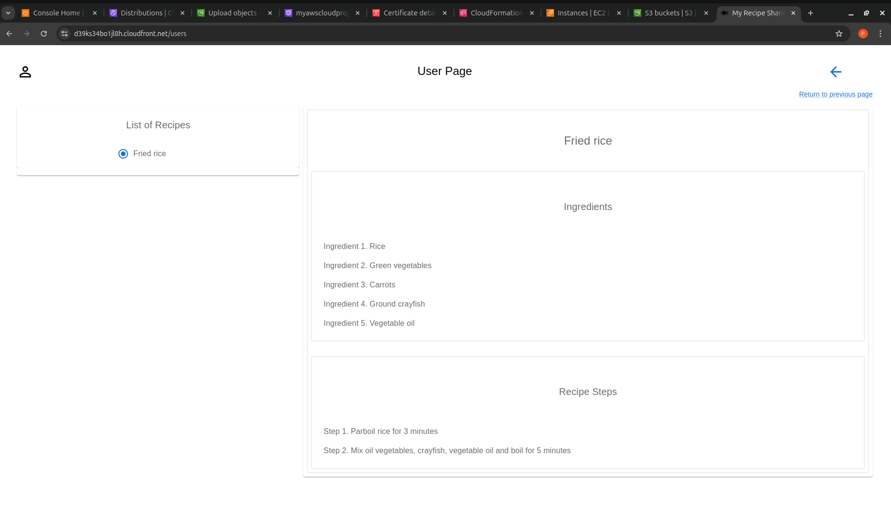
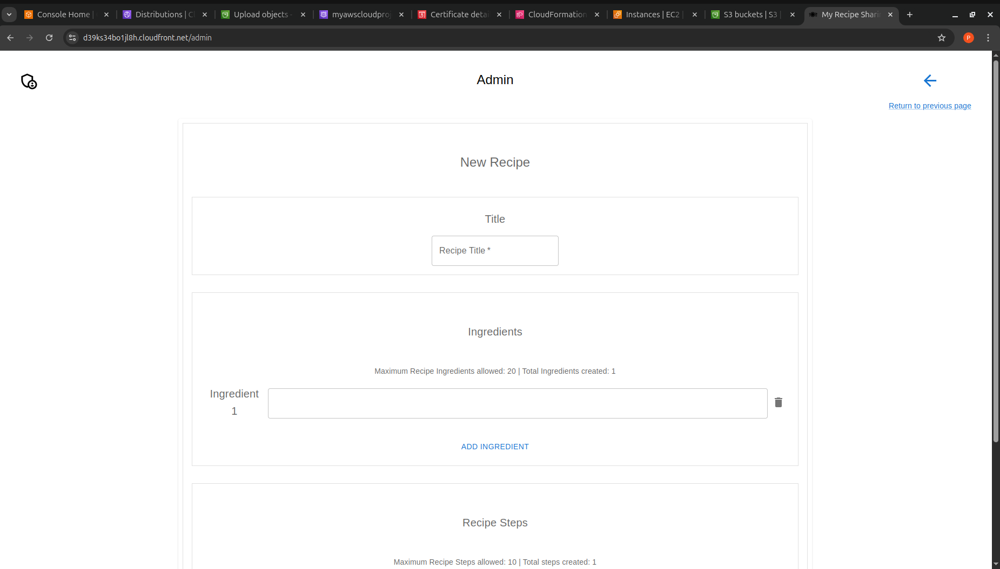
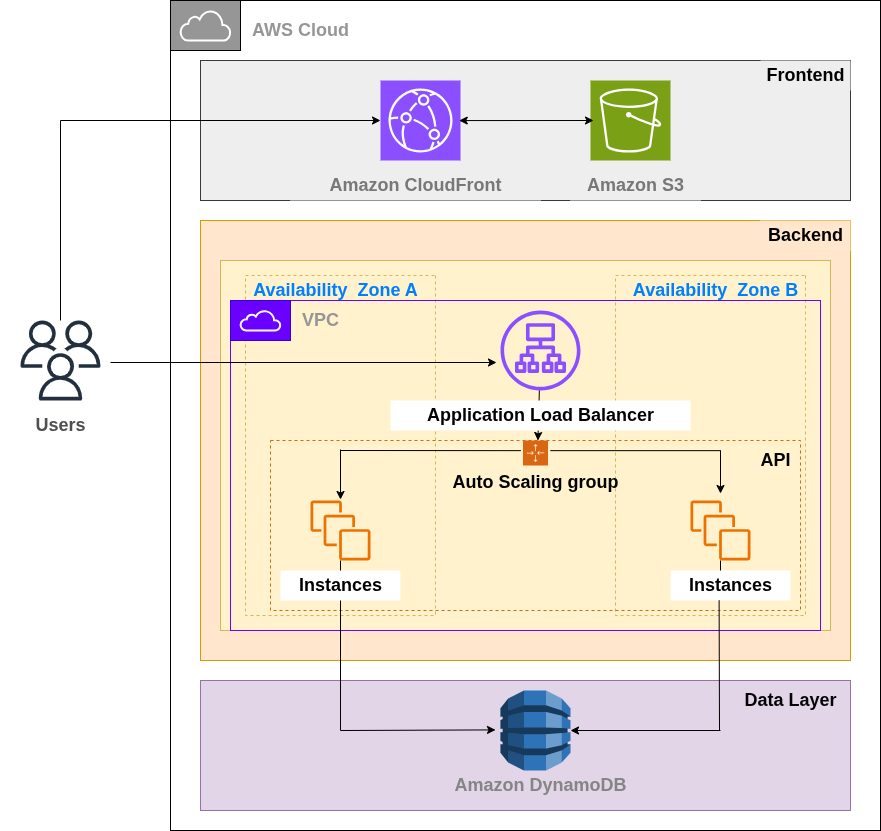

# Cloud-Native Recipe Sharing App


---

## 🧾 Project Description

This project is a full-stack **cloud-native web application** built with a modern architecture and deployed entirely on **AWS Cloud** services. It enables users to share, view, and manage recipes.

The frontend is built with **React.js** and hosted via **Amazon S3** with global distribution through **CloudFront**. The backend is developed using **Python FastAPI** running on an **EC2 instance in a private subnet**, with **Application Load Balancer** (ALB) handling traffic. **DynamoDB** is used to store recipe data. Infrastructure provisioning is handled using **AWS CloudFormation**.

---

## 🛠 Tech Stack

### Frontend
- React.js (Vite)
- AWS S3 (Static Hosting)
- AWS CloudFront (CDN & SSL)
- Route 53 (Domain DNS)
- AWS ACM (SSL certificate)

### Backend
- Python + FastAPI
- Amazon EC2 (in a private subnet)
- Application Load Balancer (ALB)
- IAM roles for secure access

### Database
- Amazon DynamoDB

### Infrastructure
- AWS CloudFormation
- YAML templates (`ch3-https.yaml`, `ch3-https-complete.yaml`)

---

## 📦 Features

- 🔐 HTTPS-secured frontend via CloudFront & ACM
- 🖼️ Server-rendered frontend from S3
- ⚡ FastAPI backend hosted in private subnet
- 📂 Recipes stored in a DynamoDB table
- 🧰 CloudFormation used for provisioning AWS infrastructure
- 🌐 Domain managed via Route 53

---

## 📷 Screenshots

### 🌐 Frontend UI






### ⚙️ AWS Architecture


# ### 📜 CloudFormation Stack
# 

---

## 🚀 Deployment Instructions

### 🛠 Prerequisites
- AWS Account with admin access
- Verified domain (e.g. via Namecheap)
- SSL Certificate via AWS ACM (in **us-east-1**)
- AWS CLI configured locally

### 🔧 Steps

1. Clone the repository:

```bash
git clone https://github.com/your-username/Cloud-Native-Recipe-Sharing-App.git
cd Cloud-Native-Recipe-Sharing-App/platform
